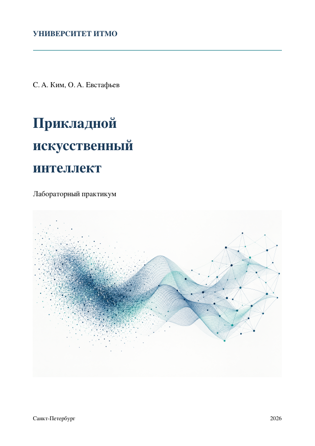

<div align="center">

# Прикладной искусственный интеллект

### Лабораторный практикум · Университет ИТМО

**Ким Станислав Александрович · Евстафьев Олег Александрович**

Python · машинное обучение · нейронные сети

[**Читать пособие**](book/practicum.pdf) · [**Начать работу**](START_HERE.md) · [**Скачать репозиторий**](https://github.com/stalkim/itmo-ml-practicum/archive/refs/heads/main.zip)

<a href="book/practicum.pdf"></a>

</div>

## От данных к обоснованному выводу

Три лабораторные работы по дисциплине **«Прикладной искусственный интеллект»**: от сравнения классификаторов до обучения нейросети и распознавания изображений. Материал подходит для первого знакомства с машинным обучением; нужны базовый Python, массивы и таблицы.

В пособии — необходимая теория, разобранные примеры, порядок выполнения, планы экспериментов и вопросы для защиты. Ноутбуки помогают получить исходный результат, исследовать настройки и объяснить ошибки модели.

## Лабораторные работы

| Работа | Что вы научитесь делать | Ноутбук | Данные |
|---|---|---|---|
| [**1. Классификация активности**](labs/01_classification) | Сравнивать модели, разделять данные по участникам, читать матрицу ошибок | [Открыть](labs/01_classification/lab1_activity.ipynb) | [Состав файлов](labs/01_classification/data/README.md) |
| [**2. Прогнозирование стоимости жилья**](labs/02_regression) | Готовить числовые и категориальные признаки, обучать полносвязную сеть, оценивать ошибку | [Открыть](labs/02_regression/lab2_housing.ipynb) | [Состав файлов](labs/02_regression/data/README.md) |
| [**3. Классификация изображений цветов**](labs/03_cnn) | Работать со свёртками, использовать перенос обучения, сравнивать архитектуры | [Открыть](labs/03_cnn/lab3_flowers.ipynb) | [Состав файлов](labs/03_cnn/data/README.md) |

**Дополнительно:** короткий обзор TabM и TabPFN-3 и необязательный опыт с усреднением прогнозов трёх нейросетей. Для основных работ этот опыт не требуется.

## Быстрый старт

1. Прочитайте введение и раздел «Первое знакомство с машинным обучением» в [пособии](book/practicum.pdf).
2. Скачайте **весь репозиторий**: **Code → Download ZIP**, затем распакуйте его.
3. Проверьте папку `data/` выбранной работы. Если в ней пока только инструкция, добавьте выданные преподавателем файлы.
4. Подготовьте Python и Jupyter по [инструкции запуска](START_HERE.md), откройте ноутбук нужной работы.
5. Выполняйте ячейки сверху вниз. Данные читаются из соседней папки `data/`, результаты сохраняются в `runs/` внутри этой же работы.

На GitHub ноутбук можно прочитать; код выполняется в **Jupyter на вашем компьютере или учебном сервере**. Общие учебные модули находятся в `code/`, поэтому скачивайте весь проект.

## Устройство проекта

```text
book/                         Пособие в PDF и обложка
code/                         Общие учебные модули
labs/
  01_classification/          Работа 1: ноутбук, README, data/
  02_regression/              Работа 2: ноутбук, README, data/
  03_cnn/                     Работа 3: ноутбук, README, data/
START_HERE.md                 Инструкция первого запуска
CITATION.cff                  Авторы и сведения для цитирования
```

## Версия и воспроизводимость

Комплект **v0.11 · 20 сентября 2026**: пособие, ноутбуки и учебный код. Перед началом работы проверьте наличие файлов в `data/` своей лабораторной работы по [списку](START_HERE.md#2-проверьте-данные).

Сохраняйте разбиение данных, seed, версии библиотек, настройки и результаты опытов. Перед сдачей перезапустите ядро Jupyter и выполните ноутбук целиком. В третьей работе заранее изучите расчёт памяти исходной CNN в пособии.

## Авторы и обратная связь

**Ким Станислав Александрович**, **Евстафьев Олег Александрович**. Университет ИТМО, 2026.

При использовании материалов укажите авторов, название пособия, версию и [адрес репозитория](https://github.com/stalkim/itmo-ml-practicum). Машиночитаемые сведения находятся в [CITATION.cff](CITATION.cff).

Об опечатке или ошибке можно сообщить через [Issues](https://github.com/stalkim/itmo-ml-practicum/issues), указав страницу или ячейку, версию материалов и шаги воспроизведения.
